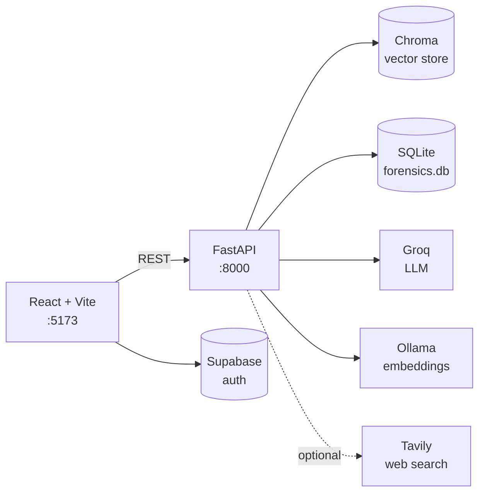

# Crime Nexus

AI-powered digital forensics workspace. Upload case evidence, then question it in natural language, reconstruct a timeline, surface anomalies, and map the people involved — all grounded in the documents you supplied.

The backend is a FastAPI service ("NEXUS - Digital Forensics RAG API") that ingests documents into a Chroma vector store and answers questions through a LangChain retrieval pipeline. The frontend is a React investigation dashboard.

## Features

- **Evidence ingestion** — upload individual documents or a ZIP archive of a case file. PDF, DOCX, DOC, PPTX, PPT, RTF, TXT, CSV, JSON, and LOG are supported; rich formats are parsed with Docling.
- **RAG chat** — ask questions about the evidence and get answers with source citations. An optional deep-research toggle widens the search to the web via Tavily.
- **Timeline reconstruction** — extract dated events from the evidence and view them chronologically, optionally filtered to a single entity.
- **Anomaly detection** — score documents and events for inconsistencies worth a second look.
- **Entity extraction and graph** — pull people and their relationships out of the evidence and render them as a force-directed graph.
- **Investigation notes** — a draggable sidebar of case notes with deep links back to evidence.
- **Sessions** — each investigation is a session with its own evidence, chat history, notes, and vector collection.

## Architecture



Evidence flows in through the upload endpoints, gets split into chunks, embedded with Ollama's `nomic-embed-text`, and stored in a per-session Chroma collection. Questions retrieve the top matching chunks and pass them to Groq for generation. Sessions, messages, notes, people, timelines, and anomalies live in SQLite.

## Tech stack

**Backend** — Python 3.13, FastAPI, Uvicorn, LangChain, Chroma, Docling, Pydantic Settings, SQLite. Generation runs on Groq (`llama-3.3-70b-versatile` for chat, entity profiling, and anomaly detection; `llama-3.1-8b-instant` for timeline extraction). Embeddings run locally on Ollama (`nomic-embed-text`).

**Frontend** — React 19, Vite 7, Tailwind CSS 4, React Router 7, Supabase JS, react-force-graph-2d, react-markdown, lucide-react.

## Prerequisites

- Python 3.13
- [uv](https://docs.astral.sh/uv/) for backend dependency management
- Node.js 18 or newer
- [Ollama](https://ollama.com) running locally with the embedding model pulled:
  ```bash
  ollama pull nomic-embed-text
  ```
- A Groq API key — https://console.groq.com/keys
- A Supabase project for authentication — https://supabase.com

## Setup

### Backend

```bash
cd backend
uv sync
cp .env.example .env      # then fill in GROQ_API_KEY
```

`requirements.txt` is also provided if you prefer pip:

```bash
pip install -r requirements.txt
```

### Frontend

```bash
cd frontend
npm install
cp .env.example .env.local   # then fill in the Supabase values
```

## Environment variables

### Backend — `backend/.env`

| Variable | Required | Default | Purpose |
|---|---|---|---|
| `GROQ_API_KEY` | Yes | — | Chat, entity extraction, timeline, anomaly detection. The app will not start without it. |
| `TAVILY_API_KEY` | No | empty | Enables the deep-research toggle in chat. Disabled when blank. |
| `GOOGLE_API_KEY` | No | empty | Only needed if you switch to Google embeddings. |
| `OLLAMA_BASE_URL` | No | `http://localhost:11434` | Ollama endpoint for embeddings. |
| `CHROMA_DB_PATH` | No | `./chroma_db` | Vector store location, relative to `backend/`. |
| `CHUNK_SIZE` | No | `1000` | Characters per chunk at ingestion. |
| `CHUNK_OVERLAP` | No | `200` | Overlap between chunks. |
| `TOP_K_RETRIEVAL` | No | `7` | Chunks retrieved per query. |

### Frontend — `frontend/.env.local`

| Variable | Required | Default | Purpose |
|---|---|---|---|
| `VITE_API_URL` | No | `http://localhost:8000` | Backend base URL. |
| `VITE_SUPABASE_URL` | Yes | — | Supabase project URL, used for auth. |
| `VITE_SUPABASE_ANON_KEY` | Yes | — | Supabase anon key. |

## Running

Two terminals. Backend first — the frontend expects it on port 8000.

```bash
# Terminal 1
cd backend
uv run python main.py          # http://localhost:8000, auto-reload enabled
```

```bash
# Terminal 2
cd frontend
npm run dev                    # http://localhost:5173
```

Interactive API docs are at http://localhost:8000/docs.

CORS is restricted to `localhost` and `127.0.0.1` on ports 5173 and 3000. Serving the frontend from any other origin requires editing the `allow_origins` list in `backend/main.py`.

On first run the backend creates `backend/data/` (SQLite database and uploads) and `backend/chroma_db/` automatically. Both are gitignored.

## Project structure

```
Crime-Nexus/
├── backend/
│   ├── main.py                    FastAPI app, all HTTP endpoints
│   ├── core/
│   │   ├── ingestion.py           document loading, splitting, ZIP extraction
│   │   ├── rag_pipeline.py        vector store, retriever, chat chain
│   │   ├── timeline_extractor.py  event extraction from evidence
│   │   ├── anomaly_detector.py    inconsistency scoring
│   │   ├── User_profiling.py      entity and relationship extraction
│   │   └── models.py              shared Pydantic models
│   ├── config/settings.py         env-backed settings
│   ├── utils/
│   │   ├── session_handler.py     SQLite persistence layer
│   │   └── file_processing.py     file helpers
│   ├── evaluation/rag_metrics.py  retrieval quality metrics
│   ├── chroma_db/                 vector store (generated, gitignored)
│   └── data/                      SQLite + uploads (generated, gitignored)
└── frontend/
    └── src/
        ├── App.jsx                routing and top-level state
        ├── components/
        │   ├── views/             Landing, Auth, Upload, Processing, Dashboard, Hero
        │   ├── tabs/              Chat, Timeline, Evidence, People, RawEvidence
        │   ├── layout/            Sidebar
        │   └── ui/                StatCard, AnomalyBadge, NotesSidebar, ...
        ├── utils/api.js           backend client
        └── lib/supabase.js        Supabase client
```

## API reference

Base URL `http://localhost:8000`. Full interactive schema at `/docs`.

**Health**

| Method | Path | Purpose |
|---|---|---|
| GET | `/` | Service banner |
| GET | `/health` | Health check |

**Sessions**

| Method | Path | Purpose |
|---|---|---|
| GET | `/sessions` | List investigations |
| POST | `/sessions` | Create one |
| GET | `/sessions/{session_id}` | Fetch one |
| PUT | `/sessions/{session_id}` | Rename |
| DELETE | `/sessions/{session_id}` | Delete session and its data |

**Notes**

| Method | Path | Purpose |
|---|---|---|
| GET | `/sessions/{session_id}/notes` | List notes |
| POST | `/sessions/{session_id}/notes` | Create note |
| PUT | `/sessions/{session_id}/notes/{note_id}` | Update note |
| DELETE | `/sessions/{session_id}/notes/{note_id}` | Delete note |

**Evidence**

| Method | Path | Purpose |
|---|---|---|
| POST | `/sessions/{session_id}/upload` | Upload a document or ZIP; ingests into the vector store |
| GET | `/sessions/{session_id}/files` | List uploaded files |
| GET | `/sessions/{session_id}/files/download/{filename}` | Download a file |
| GET | `/sessions/{session_id}/search?query=&k=` | Raw similarity search |

**Chat**

| Method | Path | Purpose |
|---|---|---|
| POST | `/chat` | Ask a question. Body: `session_id`, `message`, `deep_research` |
| GET | `/sessions/{session_id}/messages` | Chat history |
| DELETE | `/sessions/{session_id}/messages` | Clear history |

**Entities**

| Method | Path | Purpose |
|---|---|---|
| POST | `/sessions/{session_id}/extract-entities` | Run entity extraction over the evidence |
| GET | `/sessions/{session_id}/graph` | Entity relationship graph |
| GET | `/sessions/{session_id}/people` | List people |
| POST | `/sessions/{session_id}/people` | Add a person manually |

**Timeline**

| Method | Path | Purpose |
|---|---|---|
| POST | `/sessions/{session_id}/extract-timeline` | Extract dated events |
| GET | `/sessions/{session_id}/timeline?entity=` | Fetch timeline, optionally per entity |

**Anomalies**

| Method | Path | Purpose |
|---|---|---|
| POST | `/sessions/{session_id}/detect-anomalies` | Run detection |
| GET | `/sessions/{session_id}/anomalies` | Fetch results |

## Troubleshooting

**Backend exits immediately with a validation error for `GROQ_API_KEY`** — `backend/.env` is missing or the key is blank. It is the one required setting.

**Uploads fail or chat returns no sources** — Ollama is not reachable. Confirm it is running and the model is pulled:
```bash
ollama list | grep nomic-embed-text
curl http://localhost:11434/api/tags
```

**Browser console shows CORS errors** — the frontend is being served from an origin outside the allowlist in `backend/main.py`. Use port 5173 or 3000, or add your origin there.

**Deep research returns nothing** — `TAVILY_API_KEY` is unset. The rest of chat works without it.

**Frontend loads but login fails** — `VITE_SUPABASE_URL` or `VITE_SUPABASE_ANON_KEY` is missing from `frontend/.env.local`. Vite only reads these at startup, so restart the dev server after editing.
