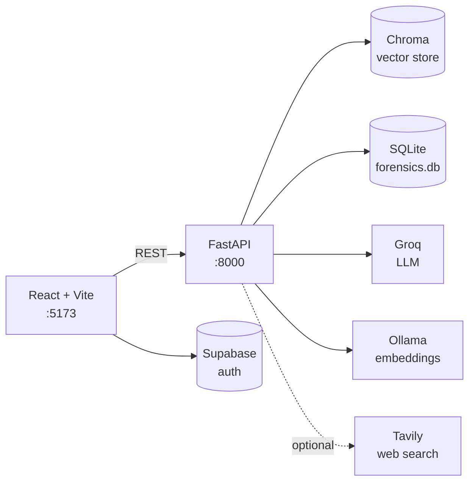

# Crime Nexus

An investigation workspace for digital evidence. Drop in the case files, then ask questions about them the way you would ask a colleague — who was involved, what happened when, what does not add up. Every answer is grounded in the documents you uploaded and cites the file it came from.

Under the hood: a FastAPI service ingests documents into a Chroma vector store and answers through a LangChain retrieval pipeline, with a React dashboard on top.

## Features

Work is organized into **sessions** — one per investigation, each with its own evidence, chat history, notes, entity graph, timeline, and isolated vector collection. Nothing leaks between cases.

### Evidence ingestion

Drop in a single document or a ZIP of the whole case file. Supported: `.pdf`, `.docx`, `.doc`, `.pptx`, `.ppt`, `.rtf`, `.txt`, `.csv`, `.json`, `.log`.

Rich formats go through [Docling](https://github.com/docling-project/docling), which keeps tables and layout intact rather than flattening everything to a wall of text — it matters when the evidence is a report with structured fields. Plain-text formats take a lighter path. Extracted text is cached beside the original, duplicate uploads are caught by file hash, and the result is chunked (1000 characters, 200 overlap) and embedded into the session's collection.

### Chat

Ask a question, get a structured forensic report back rather than a paragraph of prose. Retrieval works harder than a plain similarity lookup:

1. `MultiQueryRetriever` rewrites your question into 4 alternate phrasings and keeps the original — 5 queries total.
2. Each runs through an MMR retriever (`k=4`, `fetch_k=8`, `lambda_mult=0.5`) that trades off relevance against diversity.
3. Results are merged and deduplicated into roughly 20 unique chunks.
4. Every chunk is wrapped in `[SOURCE]` tags so the model can cite exact filenames.
5. Groq generates the answer at `temperature=0` — no creative gap-filling.

Answers come back with a **Summary**, the extracted facts, and — the useful part — an **Evidence Gaps** section that says plainly what it could *not* find in your documents, instead of quietly inventing it. Cited files show up as Reference Source cards under each answer. A **Deep Research** toggle in the composer widens the search to the live web via Tavily when the case file alone is not enough.

### Analysis

Every evidence file in one table, with its category, case relevance, and an anomaly score out of 100. The score is a triage aid, not a verdict — it flags internal inconsistencies, timeline conflicts, and unusual content patterns so you know which document to read first. **Re-detect Anomalies** re-runs scoring across the session.

### People

Who appears in the case, and how they connect. **Extract from Evidence** pulls people, organizations, and relationships out of the documents, each carrying its own anomaly score and the flags behind it. View the result as an interactive force-directed graph or as a plain list — the graph is better for spotting clusters, the list for working through them. Click an entity anywhere else in the app and this tab jumps to it.

### Timeline

The case in chronological order, rebuilt from dates buried in the documents. Each event shows its type, the actors involved, any artifacts referenced, the source file, and a confidence level — so a low-confidence guess never sits on the page looking like an established fact. Filter to one entity to follow just their movements, or **Re-Extract Timeline** to rebuild from scratch.

### Raw Files

The original evidence, unprocessed. PDFs preview inline; anything can be opened in a new tab or downloaded. Useful when you want to check what the model actually read.

### Investigation notes

A side panel that follows you across tabs. Drag entities, timeline events, or files into a note and they attach as deep links you can click back to later. Tag notes to group them. Everything persists per session.

## Architecture



Worth noting where the work happens: embeddings run **locally** through Ollama, so the raw text of your evidence is never shipped to an embedding provider. Only the retrieved chunks needed to answer a given question go out to Groq for generation. Sessions, messages, notes, people, timelines, and anomalies all live in a local SQLite file.

## Tech stack

**Backend** — Python 3.13, FastAPI, Uvicorn, LangChain, Chroma, Docling, Pydantic Settings, SQLite. Generation runs on Groq (`qwen/qwen3.8-27b` for chat, entity profiling, timeline extraction, and anomaly detection). Embeddings run locally on Ollama (`nomic-embed-text`).

**Frontend** — React 19, Vite 7, Tailwind CSS 4, React Router 7, Supabase JS, react-force-graph-2d, react-markdown, lucide-react.

## Setup

Five steps from a fresh clone to a running app. The first three are one-time installs; budget about fifteen minutes for the whole thing, most of it waiting on downloads.

### 1. Install the toolchain

| Tool | Why | Install |
|---|---|---|
| Python 3.13+ | backend runtime | `uv` can fetch it for you (next row) |
| [uv](https://docs.astral.sh/uv/) | backend dependencies | `brew install uv` — or see the uv docs for Linux/Windows |
| Node.js 18+ | frontend | `brew install node` / [nodejs.org](https://nodejs.org) |
| [Ollama](https://ollama.com) | local embedding model | `brew install ollama` — or download from ollama.com |

`uv` reads `backend/.python-version` and downloads a matching Python automatically, so you do not need to install 3.13 yourself.

### 2. Start Ollama and pull the embedding model

Embeddings run on your machine, so Ollama has to be up before you upload anything. If it is not, ingestion fails rather than falling back to a hosted model.

```bash
ollama serve                     # leave running, listens on :11434
ollama pull nomic-embed-text     # 274 MB, one time
```

Verify it:

```bash
curl http://localhost:11434/api/tags     # should list nomic-embed-text
```

### 3. Get API keys

- **Groq — required.** https://console.groq.com/keys. Free tier is enough. The backend refuses to start without it.
- **Tavily — optional.** https://app.tavily.com. Only enables the Deep Research toggle in chat.
- **Supabase — required for real login.** https://supabase.com, create a free project, then Project Settings → API for the URL and anon key. Under Authentication → Providers → Email, turn off *Confirm email* so signup works without a mail round-trip. To skip Supabase entirely while developing, see [Running without Supabase](#running-without-supabase).

### 4. Backend

```bash
cd backend
uv sync                   # creates .venv, installs everything from uv.lock
cp .env.example .env      # then set GROQ_API_KEY
```

`uv sync` pulls in Docling and its Torch dependency, so expect a few minutes and roughly 1.3 GB in `.venv`.

If you would rather use pip with your own Python 3.13:

```bash
python3.13 -m venv .venv && source .venv/bin/activate
pip install -r requirements.txt
```

### 5. Frontend

```bash
cd frontend
npm install
cp .env.example .env.local   # then set the Supabase values
```

## Environment variables

### Backend — `backend/.env`

| Variable | Required | Default | Purpose |
|---|---|---|---|
| `GROQ_API_KEY` | Yes | — | Chat, entity extraction, timeline, anomaly detection. The app will not start without it. |
| `TAVILY_API_KEY` | No | empty | Enables the deep-research toggle in chat. Disabled when blank. |
| `GOOGLE_API_KEY` | No | empty | Only needed if you switch to Google embeddings. |
| `OLLAMA_BASE_URL` | No | `http://localhost:11434` | Ollama endpoint for embeddings. |
| `CHROMA_DB_PATH` | No | `./chroma_db` | Vector store location, relative to `backend/`. |
| `CHUNK_SIZE` | No | `1000` | Characters per chunk at ingestion. |
| `CHUNK_OVERLAP` | No | `200` | Overlap between chunks. |
| `TOP_K_RETRIEVAL` | No | `7` | Chunks retrieved per query. |

### Frontend — `frontend/.env.local`

| Variable | Required | Default | Purpose |
|---|---|---|---|
| `VITE_API_URL` | No | `http://localhost:8000` | Backend base URL. |
| `VITE_SUPABASE_URL` | Yes | — | Supabase project URL, used for auth. Must be non-empty — see below. |
| `VITE_SUPABASE_ANON_KEY` | Yes | — | Supabase anon key. Must be non-empty — see below. |
| `VITE_DEV_BYPASS_AUTH` | No | `false` | Local development only. Set to `true` to skip the Supabase login gate. |

Vite reads these once at startup and only exposes `VITE_`-prefixed variables to client code. Restart the dev server after editing.

### Running without Supabase

If you just want to see the app work, you can skip the login flow rather than setting up a project first. In `frontend/.env.local`:

```bash
VITE_DEV_BYPASS_AUTH=true
VITE_SUPABASE_URL=http://localhost:54321
VITE_SUPABASE_ANON_KEY=dev-placeholder-anon-key
```

The placeholder values are not decoration — leave them blank and you get the blank-page failure described in [Troubleshooting](#troubleshooting). Any non-empty strings will do; with the bypass on, no auth request is ever sent to them.

`VITE_DEV_BYPASS_AUTH` defaults to off, so this touches local development only and production builds behave normally. `.env.local` is gitignored, so the flag cannot follow you into a commit by accident.

## Running

Three terminals. Order matters: Ollama must be up before any upload, and the backend before the frontend.

```bash
# Terminal 1 — embeddings
ollama serve                   # http://localhost:11434
```

```bash
# Terminal 2 — backend
cd backend
uv run python main.py          # http://localhost:8000, auto-reload enabled
```

```bash
# Terminal 3 — frontend
cd frontend
npm run dev                    # http://localhost:5173
```

Open http://localhost:5173. Interactive API docs are at http://localhost:8000/docs.

### First run

Create a case, upload a document, and be patient. **The first upload takes several minutes** — Docling is downloading its layout and table-recognition models, and nothing in the UI says so. Watch the backend terminal instead; `[INGEST]` lines mean it is through. Every upload after that takes seconds.

Once ingestion finishes you can chat straight away. Entity extraction, timeline reconstruction, and anomaly detection are not automatic — each runs from its own tab via the **Extract** or **Re-detect** button, and takes a few seconds per document.

### Ports

| Port | Service |
|---|---|
| 5173 | Vite dev server |
| 8000 | FastAPI backend |
| 11434 | Ollama |

CORS is restricted to `localhost` and `127.0.0.1` on ports 5173 and 3000. Serving the frontend from any other origin requires editing the `allow_origins` list in `backend/main.py`.

On first run the backend creates `backend/data/` (SQLite database and uploads) and `backend/chroma_db/` automatically. Both are gitignored.

## Project structure

```
Crime-Nexus/
├── backend/
│   ├── main.py                    FastAPI app, all HTTP endpoints
│   ├── core/
│   │   ├── ingestion.py           document loading, splitting, ZIP extraction
│   │   ├── rag_pipeline.py        vector store, retriever, chat chain
│   │   ├── timeline_extractor.py  event extraction from evidence
│   │   ├── anomaly_detector.py    inconsistency scoring
│   │   ├── User_profiling.py      entity and relationship extraction
│   │   └── models.py              shared Pydantic models
│   ├── config/settings.py         env-backed settings
│   ├── utils/
│   │   ├── session_handler.py     SQLite persistence layer
│   │   └── file_processing.py     file helpers
│   ├── evaluation/rag_metrics.py  retrieval quality metrics
│   ├── chroma_db/                 vector store (generated, gitignored)
│   └── data/                      SQLite + uploads (generated, gitignored)
└── frontend/
    └── src/
        ├── App.jsx                routing and top-level state
        ├── components/
        │   ├── views/             Landing, Auth, Upload, Processing, Dashboard, Hero
        │   ├── tabs/              Chat, Timeline, Evidence, People, RawEvidence
        │   ├── layout/            Sidebar
        │   └── ui/                StatCard, AnomalyBadge, NotesSidebar, ...
        ├── utils/api.js           backend client
        └── lib/supabase.js        Supabase client
```

## API reference

Base URL `http://localhost:8000`. Full interactive schema at `/docs`.

**Health**

| Method | Path | Purpose |
|---|---|---|
| GET | `/` | Service banner |
| GET | `/health` | Health check |

**Sessions**

| Method | Path | Purpose |
|---|---|---|
| GET | `/sessions` | List investigations |
| POST | `/sessions` | Create one |
| GET | `/sessions/{session_id}` | Fetch one |
| PUT | `/sessions/{session_id}` | Rename |
| DELETE | `/sessions/{session_id}` | Delete session and its data |

**Notes**

| Method | Path | Purpose |
|---|---|---|
| GET | `/sessions/{session_id}/notes` | List notes |
| POST | `/sessions/{session_id}/notes` | Create note |
| PUT | `/sessions/{session_id}/notes/{note_id}` | Update note |
| DELETE | `/sessions/{session_id}/notes/{note_id}` | Delete note |

**Evidence**

| Method | Path | Purpose |
|---|---|---|
| POST | `/sessions/{session_id}/upload` | Upload a document or ZIP; ingests into the vector store |
| GET | `/sessions/{session_id}/files` | List uploaded files |
| GET | `/sessions/{session_id}/files/download/{filename}` | Download a file |
| GET | `/sessions/{session_id}/search?query=&k=` | Raw similarity search |

**Chat**

| Method | Path | Purpose |
|---|---|---|
| POST | `/chat` | Ask a question. Body: `session_id`, `message`, `deep_research` |
| GET | `/sessions/{session_id}/messages` | Chat history |
| DELETE | `/sessions/{session_id}/messages` | Clear history |

**Entities**

| Method | Path | Purpose |
|---|---|---|
| POST | `/sessions/{session_id}/extract-entities` | Run entity extraction over the evidence |
| GET | `/sessions/{session_id}/graph` | Entity relationship graph |
| GET | `/sessions/{session_id}/people` | List people |
| POST | `/sessions/{session_id}/people` | Add a person manually |

**Timeline**

| Method | Path | Purpose |
|---|---|---|
| POST | `/sessions/{session_id}/extract-timeline` | Extract dated events |
| GET | `/sessions/{session_id}/timeline?entity=` | Fetch timeline, optionally per entity |

**Anomalies**

| Method | Path | Purpose |
|---|---|---|
| POST | `/sessions/{session_id}/detect-anomalies` | Run detection |
| GET | `/sessions/{session_id}/anomalies` | Fetch results |

## Troubleshooting

The failures you are most likely to hit, and what they actually mean.

**Backend exits immediately:**
```
pydantic_core._pydantic_core.ValidationError: 1 validation error for Settings
GROQ_API_KEY
  Field required
```
`backend/.env` is missing or the key is blank. It is the one required setting.

**Blank white page, nothing in the console** — this one is genuinely confusing, because there is no error to go on. `VITE_SUPABASE_URL` or `VITE_SUPABASE_ANON_KEY` is empty, `createClient()` throws `supabaseUrl is required.` while the module is still loading, and React never gets as far as mounting. Confirm it from the browser console:
```js
await import('/src/lib/supabase.js')
```
Fill both values in `frontend/.env.local` and restart the dev server, or use the [Supabase bypass](#running-without-supabase).

**Uploads fail or chat returns no sources** — Ollama is not reachable. Confirm it is running and the model is pulled:
```bash
ollama list | grep nomic-embed-text
curl http://localhost:11434/api/tags
```

**First upload seems to hang** — Docling is downloading its parsing models, which takes several minutes with no progress in the UI. Watch the backend terminal; you will see `[INGEST]` lines when it finishes. Only happens once.

**Browser console shows CORS errors** — the frontend is being served from an origin outside the allowlist in `backend/main.py`. Use port 5173 or 3000, or add your origin there.

**Deep research returns nothing** — `TAVILY_API_KEY` is unset. The rest of chat works without it.

**Login fails but the page renders** — the Supabase project rejects the credentials, or email confirmation is still on. Turn off *Confirm email* under Authentication → Providers → Email.

**`uv sync` fails on Python version** — `uv` should fetch 3.13 automatically. If it does not, run `uv python install 3.13` first.
